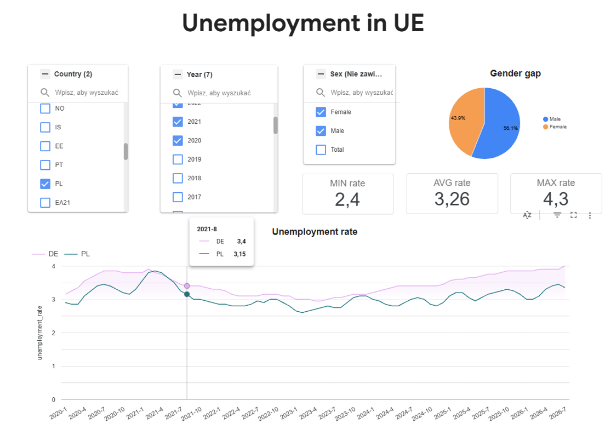

# Eurostat Unemployment Data Pipeline & Looker Studio Dashboard

An end-to-end, automated data engineering project that fetches European unemployment rate metrics from the **Eurostat API**, loads raw data into **Google Cloud Storage (GCS)**, transforms it within **Google BigQuery**, and visualizes the results on an interactive dashboard in **Looker Studio**.

---

## Architecture Overview
```text
[Eurostat API] ──> [Google Cloud Scheduler] ──> [Cloud Function / Cloud Run]
                                                                │
                                                                ▼
[Looker Studio Dashboard] <── [BigQuery Views] <── [GCS Bucket (Parquet/JSON)]
```
The pipeline runs on an automated schedule to maintain up-to-date unemployment metrics without manual intervention.

---

## Technical Stack

* **Ingestion:** Python, Google Cloud Storage
* **Orchestration:** Google Cloud Scheduler, Google Cloud Functions
* **Data Warehouse:** Google BigQuery
* **Visualization:** Looker Studio

---

## Step-by-Step Implementation

### 1. Storage Setup (Google Cloud Storage)
* Created a dedicated GCS bucket to store raw CSV from Eurostat.

### 2. Cloud Function & Orchestration
* **Cloud Function:** Developed a Python script to trigger on schedule, fetch Eurostat API endpoints and push structured files into the GCS bucket.
* **Cloud Scheduler:** Configured a cron job (`0 4 1 * *`) to trigger the Cloud Function automatically at regular intervals.

### 3. Data Warehousing & Transformation (BigQuery)
* **Raw Table:** External/Native BigQuery table connected directly to GCS files.
* **SQL Transformations & Cleaning:**
  * Handled date formatting and time-period conversions (`YYYY-MM` to DATE objects).
  * Isolated seasonal adjustment codes (`SA`, `NSA`) and unit codes (`PC_ACT`).

```sql
CREATE OR REPLACE VIEW `your_project.dataset.v_unemployment_clean` AS
SELECT

  SAFE_CAST(OBS_VALUE AS FLOAT64) AS unemployment_rate,
  PARSE_DATE('%Y-%m', TIME_PERIOD) AS report_date,
  TIME_PERIOD AS time_period_code,


  geo AS country_code,

  sex AS sex_code,
  CASE sex
    WHEN 'T' THEN 'Total'
    WHEN 'M' THEN 'Male'
    WHEN 'F' THEN 'Female'
    ELSE sex
  END AS sex_label,

  age AS age_code,
  CASE age
    WHEN 'TOTAL' THEN 'Total'
    WHEN 'Y15-24' THEN 'Under 25 years'
    WHEN 'Y25-74' THEN '25-74 years'
    WHEN 'Y15-74' THEN '15-74 years'
    ELSE age
  END AS age_label,

  unit AS unit_code,
  CASE unit
    WHEN 'PC_ACT' THEN 'Percentage of active population (%)'
    WHEN 'THS_PER' THEN 'Thousand persons'
    WHEN 'PC_POP' THEN 'Percentage of total population (%)'
    ELSE unit
  END AS unit_label,

  s_adj AS seasonal_adjustment_code,
  CASE s_adj
    WHEN 'NSA' THEN 'Unadjusted (Niekorygowane)'
    WHEN 'SA'  THEN 'Seasonally adjusted (Korygowane sezonowo)'
    WHEN 'TCA' THEN 'Trend cycle (Cykl i trend)'
    ELSE s_adj
  END AS seasonal_adjustment_label,

  OBS_FLAG AS observation_flag

FROM `your_project.dataset.unemployed_raw`
WHERE TIME_PERIOD IS NOT NULL
```

## Dashboard (Looker Studio)
This dashboard shows unemployment data across European countries. Users can filter the metrics by country, time period, and gender. The cards at the top show the minimum, average, and maximum rates, while the line chart makes it easy to compare trends over time.



## Repository Structure
```text
├── docs/
│   └── img/
│       ├── dashboard_overview.png
│       └── architecture_diagram.png
├── cloud_functions/
│   ├── main.py
│   └── requirements.txt
├── sql/
│   ├── 01_Number_of_distinct_values.sql
│   ├── 02_view_unemployment_clean.sql
│   └── 03_avg_unemployment_rate.sql
└── README.md

```
